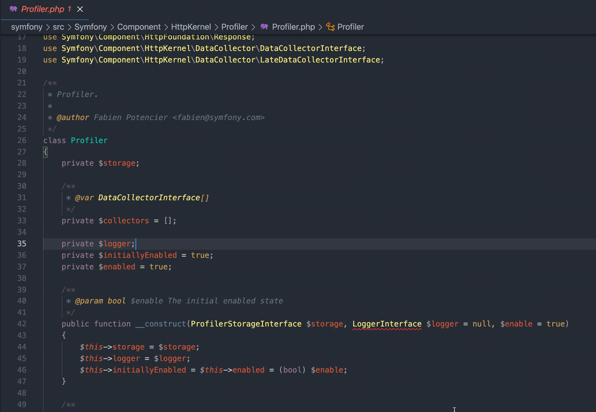

# Symfony Service Locator

This extension allows you to quickly go to service definition of current opened calss in yaml or xml config files.

## Features

To go to service definition of currently opened class hit `Cmd+Shift+P` and run
`Symofy Service Locator: Go to service definition of current class` command

Or you can find service by id using
`Symofy Service Locator: Find service under selection` command (useful for some legacy projects)

## Known Issues

For now it's not possible to find services, which classes defined through parameters,
also if autoconfiguration of services specified in config - it will not be handled.
It's possible to find only explicitly specified services for now.

## Release Notes

### 0.0.1

Initial release of Symfony Service Locator
